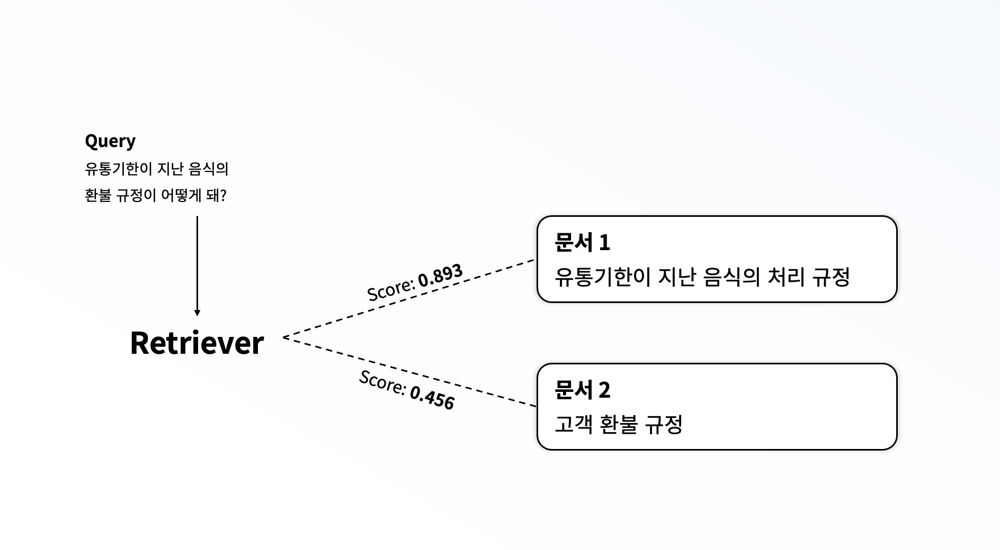
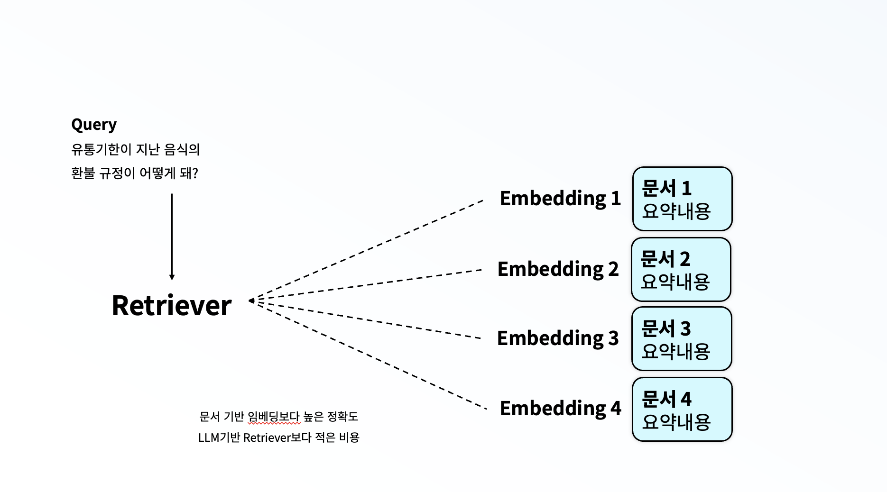

## Problem Definition
### 왜 문서 검색(Retrieve)가 잘 안될까?
* 예를 들어, `유통기한이 지난 음식의 환불 규정이 뭐야?`라는 질문이 들어왔다고 가정해봅시다. 
* 문서 중, `1. 유통기한에 관한 처리 규정`과 `2. 고객 환불 규정`이라는 두개의 문서가 있을때, Embedding 등을 활용한 유사도 기반의 검색 방식을 사용했을때, 어떤 문서를 사용할 가능성이 높을까요?
* 아마도, 1번 문서를 선택할 가능성이 높을 것입니다. 사실 진짜 의도는 '**환불**'임에도 '**유통기한**'에 더 많은 집중을 하게 될 것이죠.

## How to Solve.
### 그렇다면 LLM에게 저걸 판단하게 해보면 어떨까?
* 저희는 그래서 LLM에게 저 두개의 문서 중 어떤 것을 참고하면 좋을지 파악하면 좋을지 판단하도록 해보았습니다.
* 이 방법을 사용했을 때, 질문의 의도에 맞는 결과를 더 잘 생성하지만 모든 문서를 입력으로 주게 되어 높은 비용이 발생하는 문제가 발생하였습니다.
* 특히, 문서의 개수가 10개, 100개가 되어간다면, LLM의 입력가능한 토큰 수에서 벗어나는 문제가 발생합니다.

### LLM이 판단에 사용하는 문서를 줄여보자. 효과적으로. (Summary + LLM Retriever)
* 그래서 저희는 각 문서에 대한 요약 정보를 LLM을 통해 사전에 생성하도록 하였습니다. 매번 사용하지 않도록요.
* 그리고 해당 정보를 저장해두었습니다. 그리고 LLM에게 해당 요약 정보를 기반으로 어떤 문서를 참고하면 좋을지 판단하도록 하였습니다.
* 이를 통해, 더 정확한 문서를 탐지할 수 있습니다.

### 추가적으로 얻어지는 효과 (Summary + Embedding Retreiver)
* 여기서 추가적인 실험을 위해, Summary를 사용하여 Embedding을 추출하고 이를 retrieve하였습니다. 
* 이렇게 하자, 전체 문서에 대한 임베딩을 기반으로 타겟 문서를 탐색했을 때보다 높은 정확도를 보였습니다.

## Summary Generation
* 요약을 생성하기 위해 다양한 방법을 사용할 수 있지만, 저희는 

## LLM Retriever

## Hierachical Retriever