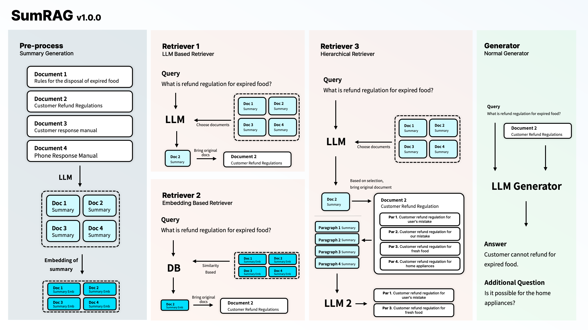

# SumRAG


* 요약데이터를 활용한 압축 및 LLM 기반 Retrieve 방식을 통해 더욱 효과적인 데이터 검색으로 정확한 정답을 도출할 수 있는 기법을 제안합니다.
* 또한, Hierachy한 검색 기법으로, 기존 대비 더 적은 데이터를 생성에 활용할 수 있도록 특정하여, 정확한 결과물을 도출합니다.
* 자세한 개발 과정과 동기는 [이 문서](./PD.md)를 참고하세요.

## How to install
```bash
pip install git+https://github.com/kojunseo/SumRAG
```

## How to use
### 1. Prepare data
```
-folderA
 ├---Document 1
 ├---Document 2
 └---Document 2 
```

* Document1: #뒤에 제목 \n뒤에 실제 내용 \n은 몇개를 써도 무방함
```
#한글은 무엇인가?\n한글은 대한민국의 문자로...
#누가 한글을 만들었는가?\n한글을 만든사람: 세종대왕
#한글의 구조\n한글은 다음으로 구성됨\n자음: N개\n모음:N개
```

### 2. Load Data & Save the data
* Preprocess and load from `folderA`
```python
from SumRAG import LLMs
from SumRAG.documents import SumInput

documents = SumInput.load_from_files("./folderA", LLMs.gpt3_5)
```

* Save the Document
```python
documents.save("./folderA_doc")
```

* Load from saved data
```python
documents.load("./folderA_doc")
```

### Define Retriever, Generator, and ask question
* For more details about each modules, refer the docstring.
```python
from SumRAG import LLMs, EMBs
from SumRAG.retrieve import HierLLMRetriever, HierEMBMixRetriever, LLMRetriever, EMBRetriever
from SumRAG.generation import BasicGenerator

# choose one
retriever = LLMRetriever(llm=LLMs.gpt3_5, s_input=documents)
retriever = EMBRetriever(emb=EMBs.openai, s_input=documents)
retriever = HierLLMRetriever(llm=LLMs.gpt3_5, s_input=documents)
retriever = HierEMBMixRetriever(llm=LLMs.gpt3_5, emb=EMBs.openai, s_input=documents)

generator = BasicGenerator(llm=LLMs.gpt3_5, retriever_fn=retriever)
print(generator("상한 식품의 환불은 어디에 물어봐야 하나요?"))
```

### Full Example Code
```python
from SumRAG import LLMs, EMBs
from SumRAG.retrieve import HierRetriever, LLMRetriever, EMBRetriever
from SumRAG.generation import BasicGenerator
from SumRAG.documents import SumInput

documents = SumInput.load_from_files("./folderA", LLMs.gpt3_5)
documents.save("./folderA_doc")
# documents.load("./folderA_doc")

retriever = HierLLMRetriever(emb=EMBs.openai, s_input=documents)
generator = BasicGenerator(llm=LLMs.gpt3_5, retriever_fn=retriever, output_parser=StrOutputParser())

print(generator("상한 식품의 환불은 어디에 물어봐야 하나요?"))
```